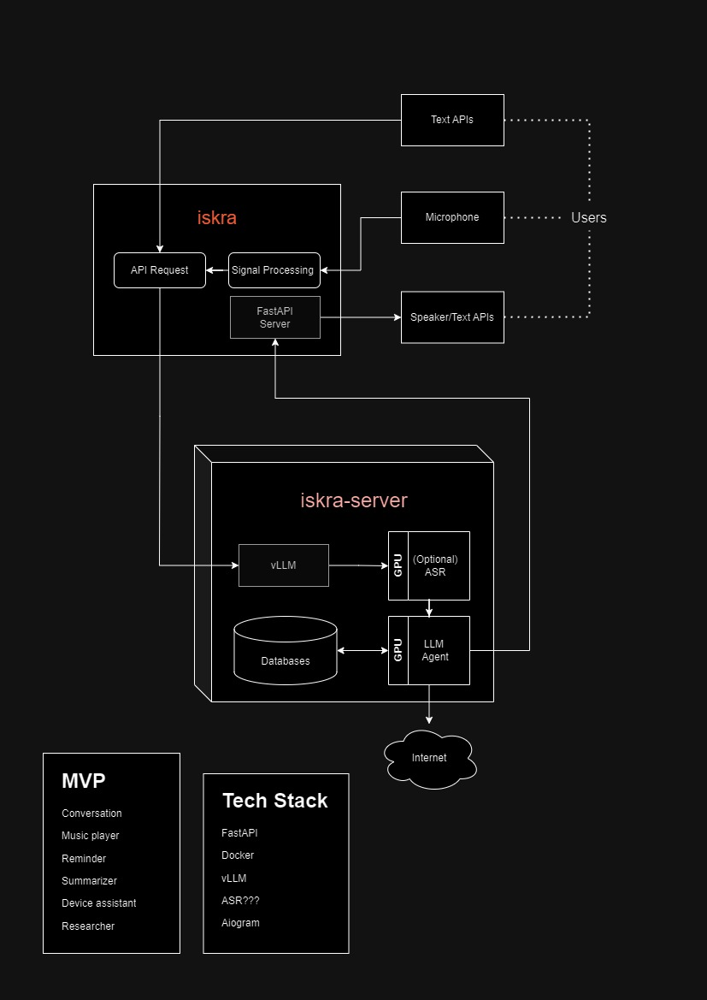

 

## Features in order of completion:
- [x] LLM conversation via Telegram Bot
- [x] Setup Sporify Player
- [X] Setup Telegram Bot to play Spotify Music (Basic Agent)
- [X] Connect I/O devices (Microphone, Speaker) to iskra
- [X] Implement ASR and word detection with connected devices
- [X] Setup Basic Agent with ASR
- [X] Implement local/online TTS
- [X] Implement Basic Agent with ASR, TTS and Spotify Player
- [X] Apply streaming optimizations to ASR, LLM and TTS to reduce latency
- [ ] Implement stop words and background query for stopping model responses
- [ ] Implement basic conversation history
- [ ] Implement advanced conversation history with caching and SQL/NoSQL database

## Spotify Player
- [X] Setup Spotify Player
- [X] Setup Telegram Bot to play Spotify Music (Basic Agent)
- [X] Setup queues, stop, pause, resume, skip functionality
- [ ] Improve recommendation queues as a user asks to play specific music
- [ ] Add function to save, delete and play user favorite songs

## LLM Tuning
- [X] CoT dataset
- [X] Conversational dataset
- [X] Writing dataset
- [X] Code dataset
- [X] Math dataset
- [ ] Train search classifier
- [ ] Convert conversational to search dataset
- [ ] Multispeaker dataset (maybe convert instruct to multispeaker)